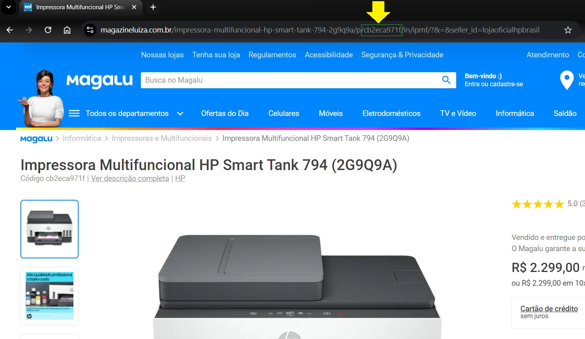

# Bot em Python para buscar preço de um produto em site 💻🌐

<h3>Desenvolvido no programa Destrava Dev, do Dev Aprender | Jhonatan de Souza 🚀🚀</h3>
<div>


## Bibliotecas utilizadas

-python-dotenv
-selenium
-webdriver-manager
-pandas
-openpyxl
-schedule
-termcolor
</div>

## Instruções:

 <h3> Instalação das bibliotecas:</h3>

 - Basta executar o comando:


```bash
pip install -r requirements.txt
```

#### Arquivo .env:
<h4>Utilizando Senhas de app do Google (Tem que habilitar verificação em duas etapas antes):</h4>

[https://myaccount.google.com/apppasswords](https://myaccount.google.com/apppasswords)

```env
# Configurações do SMTP
SMTP_USER=your_email@gmail.com
SMTP_PASSWORD=your_password
TO=recipient_email@example.com
```


#### id_produto.txt:
- Definir qual produto vai ser monitorado
- Identificar qual id do produto (conforme imagem abaixo)
- Colar o ID do produto no arquivo id_produto.txt



